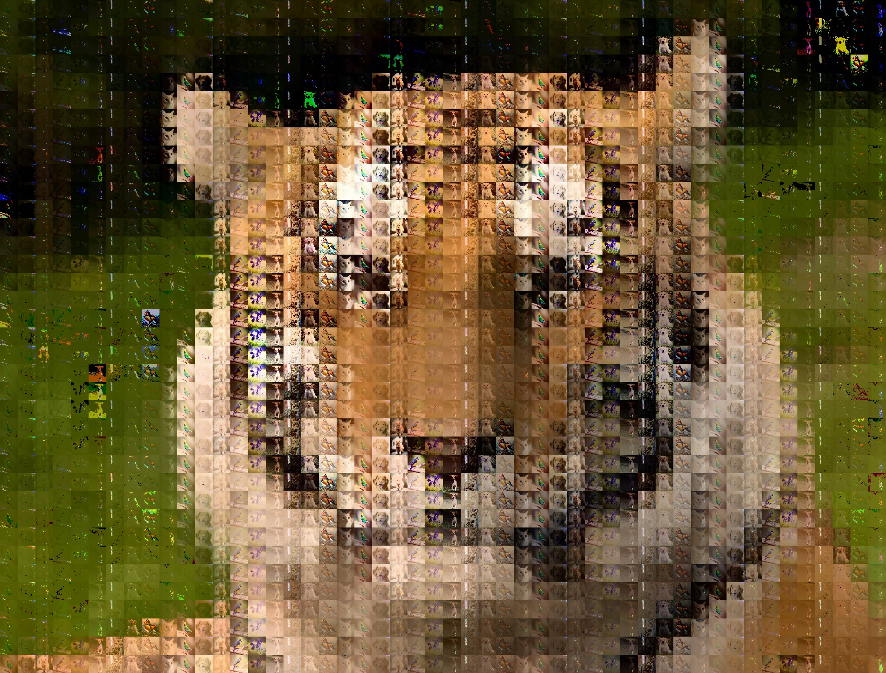

# Merge Them All
This project is for merging different images into one(see demo).

## Install
### Clone repo
```sh
git clone git@github.com:liuyuzhenn/MTA.git 
```

### Requirements
- opencv
- numpy
- scipy 1.7.1

```sh
pip install opencv-python numpy scipy
```

## Usage
```sh
python MTA.py --img_dir ./pics --dst_img ./tiger.jpeg -g 50 -s 7.5 -j 2 
```


## Demo
<div align=center>


<div>
